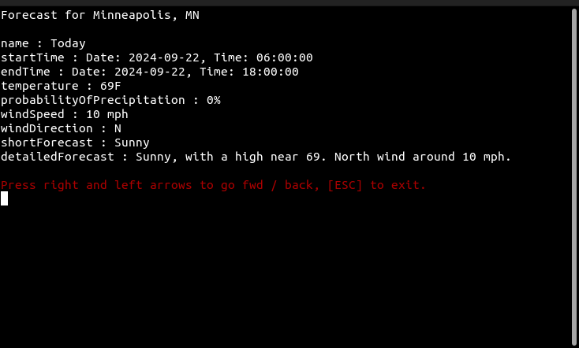
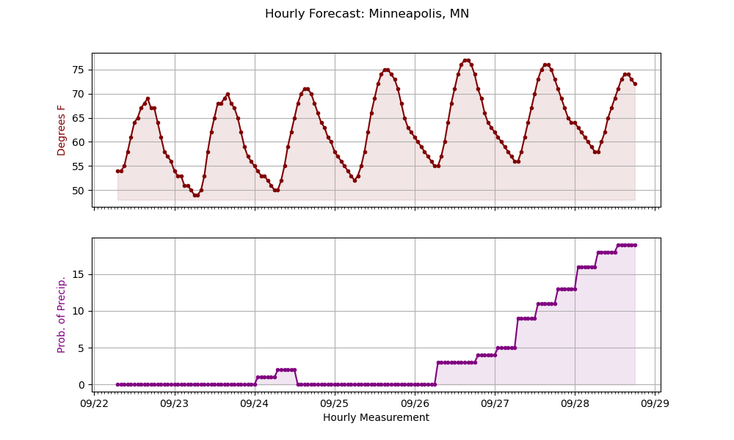
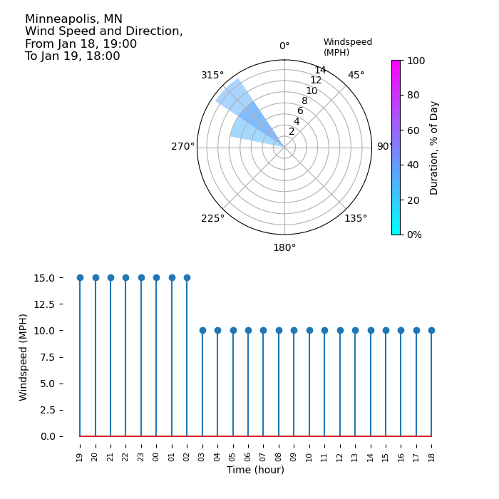

 # Retrive an NWS Weather Forecast

 The following tools can be used to display weather forecast data provided by the U.S. National Weather Service using the API at [API.weather.gov](https://api.weather.gov/).

 The class methods in `nws_api.py` interact with the API, being called from the python scripts listed below.
 ## forecast.py

This tool interacts with a United States National Weather Service
REST API to retrive a 10-day weather forecast and display it in an
interactive command shell. It can be passed latitude and longitude 
coordinates or, if none are passed, it will return the forcast for 
downtown **Minneapolis, Minnesota**.

Examples: 
* `python3 forecast.py 45,-93`
* `python3 forecast.py 44.977 93.272`
* `python3 forecast.py`

Latitude and Longitude coordinates, if passed, can be seperated by a 
comma or a space, and can include or exclude a '-' in front of the 
longitude coordinate. Note that only coordinates within a box roughly 
enclosing the United States are accepted as valid input, as the forecast
is provided by a U.S. government agency. 

At this time `forecast.py` only works in Linux shells, due to the use of the `getkey` python package. 

[][def]

[def]: https://forthebadge.com
>
## hourly_forecast.py

This tool collects hourly forecast temperatures and possibility of precipitation going out 7 days, then plots both in a graphic that can be saved as a '.PNG' file.
It uses the same conventions for passing in latitude and longitude as `forecast.py` above.

This tool should work under any O.S, on any system that has the `Pandas` and `Matplotlib` libraries installed.
>
## wind_forecast.py

This tool is very similar to `hourly_forecast` above, accepting optional
coordinates, then using `Matplotlib`to display weather data. In this case
24 hours of wind direction and speed ate plotted on a polar bar chart,
then windspeeds for each individual hour are plotted on a stem plot,
both beginning with the first data point after the current time.

Like the `hourly_forecast` tool above, this tool should work under any O.S,
on any system that has the `Pandas` and `Matplotlib` libraries installed.
>
